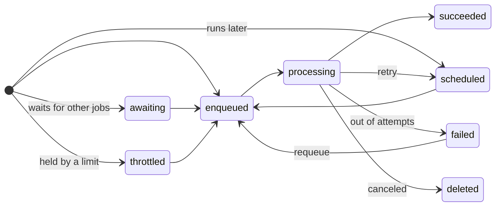

# States

A job starts in `awaiting` if it has unresolved dependencies, `scheduled` if it runs in the future,
`throttled` if it's waiting on a `Limit` slot, otherwise `enqueued`. As in Hangfire, `failed` is not a
final state: the job sits there until an operator requeues or deletes it.
