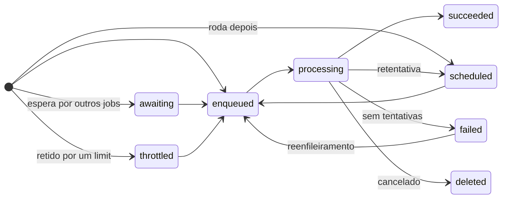

# Estados

Um job começa em `awaiting` se tiver dependências não resolvidas, `scheduled` se roda no futuro,
`throttled` se está esperando uma vaga de `Limit`, ou `enqueued` caso contrário. Como no Hangfire,
`failed` não é um estado final: o job fica lá até um operador reenfileirá-lo ou excluí-lo.
