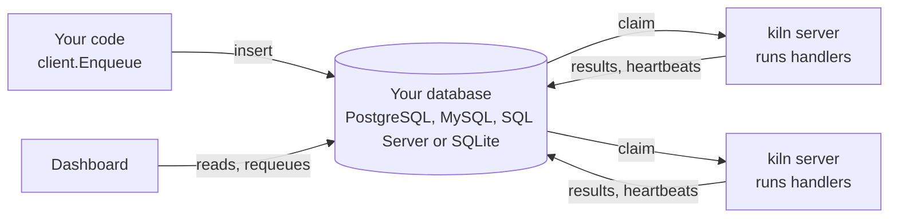

# How it works

A `Client` writes jobs to the store. Any number of `Server`s, in the same process or in others, claim the
jobs of their queues, run the handler registered for each job's kind and write the outcome back. They
learn about new work from the database's notifications (`LISTEN`/`NOTIFY` on PostgreSQL, an optional
Redis bus on MySQL, SQL Server and SQLite) and by polling. One server at a time is also the leader: it fires recurring
jobs, rescues the jobs of servers that stopped heartbeating, and prunes old jobs. There is no broker and
no extra service to run.
