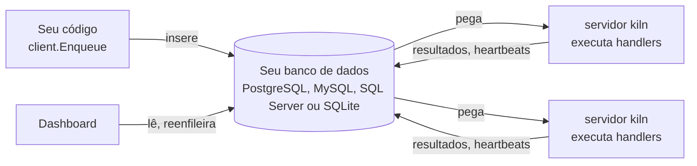

# Como funciona

Um `Client` escreve jobs no store. Qualquer número de `Server`s, no mesmo processo ou em outros, pegam os
jobs das próprias filas, executam o handler registrado para o tipo de cada job e escrevem o resultado de
volta. Eles descobrem trabalho novo pelas notificações do banco de dados (`LISTEN`/`NOTIFY` no PostgreSQL,
um bus Redis opcional no MySQL, SQL Server e SQLite) e por polling. Um servidor por vez também é o líder:
ele dispara os jobs recorrentes, resgata os jobs dos servidores que pararam de enviar heartbeat, e remove
os jobs antigos. Não existe broker nem serviço extra para rodar.
